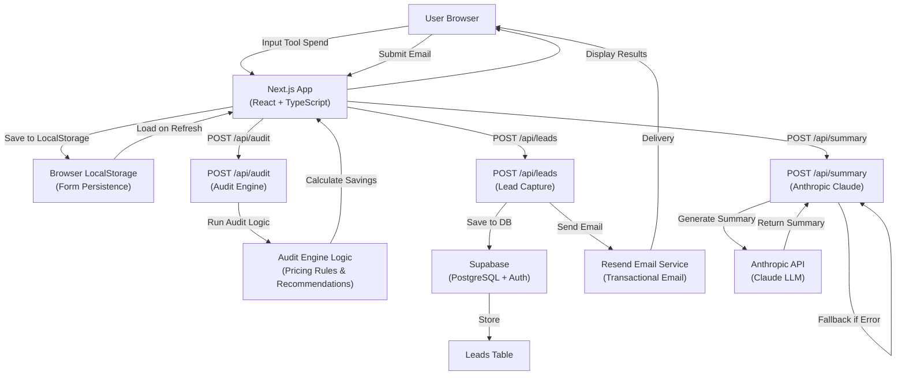

# System Architecture - AI Spend Audit Tool

## System Diagram

## Data Flow: Input → Audit → Results

1. **Input Stage**
   - User enters: Team size, primary use case, AI tools with plans, seats, and monthly spend
   - Form state persists to `localStorage` automatically
   - No backend call yet

2. **Audit Stage**
   - Frontend sends data to `POST /api/audit`
   - Backend runs audit engine:
     - Evaluates plan fit for each tool
     - Checks for cheaper alternatives
     - Calculates savings opportunities
     - Returns recommendations with reasoning
   - All logic is deterministic (no API calls, only hardcoded pricing rules)

3. **Summary Generation (Optional)**
   - Frontend sends audit results to `POST /api/summary`
   - Backend constructs prompt with audit results
   - Calls Anthropic API to generate personalized 100-word summary
   - Returns summary (or templated fallback if API fails)

4. **Results Display**
   - Frontend displays:
     - Hero section with total monthly/annual savings
     - Per-tool breakdown with recommendations
     - Personalized AI summary
     - Lead capture CTA (shown prominently if savings > $500/month)

5. **Lead Capture**
   - User enters email + optional fields
   - Frontend sends to `POST /api/leads`
   - Lead is stored in Supabase database
   - Transactional email sent via Resend
   - No payment processing (purely lead gen)

6. **Shareable Results (Future Enhancement)**
   - Each audit gets unique UUID
   - Public URL strips personally identifiable info
   - OpenGraph tags for social sharing
   - Lead email never visible in public URL

## Why This Architecture?

### Tech Stack Decisions

**Frontend: Next.js + React + TypeScript**
- ✅ Full-stack capability (frontend + API routes)
- ✅ Server-side rendering for OpenGraph
- ✅ Built-in API routes (no separate backend needed)
- ✅ TypeScript for type safety on pricing/recommendations
- ✅ Vercel deployment (designed for Next.js)

**Database: Supabase (PostgreSQL)**
- ✅ Simpler than Firebase for relational lead data
- ✅ Real PostgreSQL (can write custom queries later)
- ✅ RLS (row-level security) for multi-tenant future
- ✅ Free tier sufficient for Week 1

**LLM: Anthropic Claude**
- ✅ Better reasoning than GPT-3.5
- ✅ Cheaper than GPT-4
- ✅ Specified in assignment
- ✅ Free tier credits for internship projects

**Email: Resend**
- ✅ Simple API (easier than SES)
- ✅ Designed for developers
- ✅ Good deliverability rates
- ✅ Free tier with 100 emails/day

### Design Philosophy: Audit Engine is Deterministic

**Why hardcode pricing rules instead of using LLM for recommendations?**

1. **Defensibility**: Finance teams need to understand *why* we recommend something. "Claude said so" doesn't pass the audit.
2. **Consistency**: Same input always produces same output (no hallucinations)
3. **Explainability**: Every dollar of savings is traceable to a specific rule
4. **Speed**: No API latency; instant results
5. **Cost**: Zero API calls for the core engine

**LLM is used *only* for personalized narrative**, which is explicitly about tone/positioning, not financial logic.

### Scaling from Week 1 to 10k Audits/Day

| Concern | Week 1 Solution | 10k/day Solution |
|---------|-----------------|------------------|
| Audit latency | Hardcoded rules (instant) | Same (still instant) |
| Database writes | Single table | Partitioned by date |
| API rate limits | None needed | Queue system (Redis) |
| LLM costs | $10-50/week | Implement caching (same summary for same input pattern) |
| Frontend performance | No caching | Add Redis for computed results |
| Email delivery | Resend free tier | Dedicated mail queue + provider SLA |

**The architecture scales because:**
- Audit engine has $O(n)$ complexity (n = # of tools)
- No recursive/expensive operations
- Database queries are simple (single insert)
- Most costs are in LLM calls (solvable via caching)

## Testing Strategy

**Unit tests**: Audit engine logic (5+ tests)
- ✅ Seat optimization detection
- ✅ Plan downgrade recommendations
- ✅ Alternative tool suggestions
- ✅ Savings calculations
- ✅ Edge cases (free tier, zero spend, huge teams)

**Integration tests** (future):
- API endpoint validation
- Database writes
- Email sending

**Manual testing**:
- Form persistence across browser refresh
- LocalStorage clearing on audit run
- API error handling (Anthropic timeout, Resend failure)

## Monitoring & Analytics

Currently logged:
- Audit completions
- Lead conversions
- Anthropic fallback rate
- Email delivery status

Next week would add:
- Funnel analytics (tool input → audit → lead capture)
- Recommendation acceptance rate
- Cost per lead by channel
